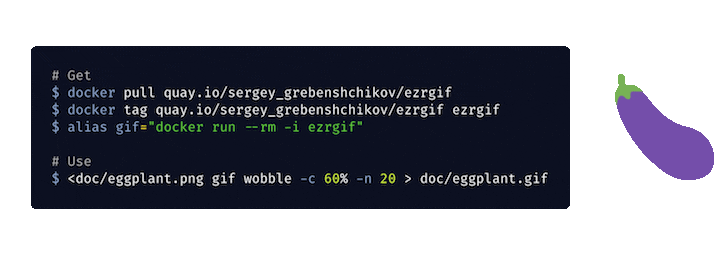
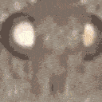

# ezrgif

 GIF effects from the command-line. 



<!-- TOC -->

- [Get it](#get-it)
    - [Docker image](#docker-image)
    - [Source (requires imagemagick+giflossy)](#source-requires-imagemagickgiflossy)
        - [Prerequisites (Mac)](#prerequisites-mac)
        - [Prerequisites (linux)](#prerequisites-linux)
- [Use it](#use-it)
- [Examples](#examples)
- [Effects](#effects)
    - [roll](#roll)
    - [wobble](#wobble)
    - [pulse](#pulse)
    - [zoom](#zoom)
    - [shake](#shake)
    - [optimize](#optimize)

<!-- /TOC -->

## Get it

### Docker image

```sh
docker pull quay.io/sergey_grebenshchikov/ezrgif
docker tag quay.io/sergey_grebenshchikov/ezrgif ezrgif
```

### Source (requires imagemagick+giflossy)

```sh
$ curl -sSL https://raw.githubusercontent.com/sgreben/ezrgif/master/gif.sh > gif.sh
$ chmod +x gif.sh
```

#### Prerequisites (Mac)

```sh
$ brew install imagemagick giflossy
```

#### Prerequisites (linux)

See [Dockerfile](Dockerfile)

## Use it

```sh
$ docker run --rm -i ezrgif -h
Usage:
    ezrgif (roll | wobble | pulse | zoom | shake | optimize) [ -h ] [ OPTIONS ]
```


## Examples

```sh
$ alias gif="docker run -i --rm ezrgif"
```
```sh
$ <doc/moth.png gif pulse -0 1.0 -1 1.5 -n 20 | gif wobble -d 3x100 -p 100% -c 100% | gif optimize > doc/moth.gif
```



```sh
$ alias gif="docker run -i --rm ezrgif"
```
```sh
$ <doc/eggplant.png gif wobble -c 60% -n 20 > doc/eggplant.gif
```


## Effects

### roll


```text
roll [-p PAD_TO] [ -c CUT_TO ] [ -d DELAY ] [ -n NUM_FRAMES ] [ -r REVOLUTIONS ] [ -s FINAL_SIZE ] INPUT
defaults:
    PAD_TO=200%
    CUT_TO=50%
    DELAY=2x100
    NUM_FRAMES=1
    REVOLUTIONS=1
    FINAL_SIZE=128x128
```

### wobble


```text
wobble [-p PAD_TO] [ -c CUT_TO ] [ -d DELAY ] [ -n NUM_FRAMES ] [ -a AMPLITUDE ] [ -f FREQUENCY ] [ -s FINAL_SIZE ] INPUT
defaults:
    PAD_TO=200%
    CUT_TO=50%
    DELAY=2x100
    NUM_FRAMES=1
    AMPLITUDE=8
    FREQUENCY=1
    FINAL_SIZE=128x128
```

### pulse


```text
pulse [-p PAD_TO] [ -c CUT_TO ] [ -d DELAY ] [ -n NUM_FRAMES ] [ -0 SCALE_MIN ] [ -1 SCALE_MAX ] [ -f FREQUENCY ] [ -s FINAL_SIZE ] INPUT
defaults:
    PAD_TO=200%
    CUT_TO=50%
    DELAY=2x100
    NUM_FRAMES=1
    SCALE_MIN=0.5
    SCALE_MAX=1.0
    FREQUENCY=1
    FINAL_SIZE=128x128
```

### zoom


```text
zoom [-p PAD_TO] [ -c CUT_TO ] [ -d DELAY ] [ -n NUM_FRAMES ] [ -0 SCALE_MIN ] [ -1 SCALE_MAX ] [ -e POWER ] [ -s FINAL_SIZE ] INPUT
defaults:
    PAD_TO=200%
    CUT_TO=50%
    DELAY=2x100
    NUM_FRAMES=1
    SCALE_MIN=0.5
    SCALE_MAX=1.0
    POWER=2.0
    FINAL_SIZE=128x128
```
### shake


```text
shake [-p PAD_TO] [ -c CUT_TO ] [ -d DELAY ] [ -n NUM_FRAMES ] [ -x AMPLITUDE_X ] [ -y AMPLITUDE_Y ] [ -f FREQUENCY_X ] [ -g FREQUENCY_Y ] [ -o PHASE_Y ] [ -r PHASE_RANDOM ] [ -s FINAL_SIZE ] INPUT
defaults:
    PAD_TO=200%
    CUT_TO=50%
    DELAY=2x100
    NUM_FRAMES=1
    AMPLITUDE_X=10
    AMPLITUDE_Y=10
    FREQUENCY_X=2
    FREQUENCY_Y=2
    PHASE_Y=pi/2
    FINAL_SIZE=128x128
    PHASE_RANDOM=pi
```

### optimize

```text
optimize [ -g TARGET_GEOMETRY ] [ -s TARGET_SIZE_KB ] [ INPUT ]
defaults:
    TARGET_GEOMETRY=128x128
    TARGET_SIZE_KB=128
```
